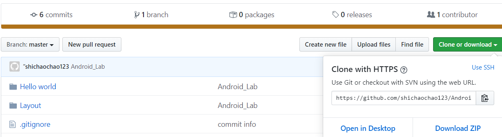

### 一、建立**android工程目录**

---

1.比如我的目录Android_Lab：

2.将工程工作空间定位到该目录里

3.工程运行结果

### 二、Git 操作

---

1.右键Android_Lab，选择**Git Bash Here**，出现一个Git Bash命令行窗口

2.建立一个本地仓库：`git init`

3.上传工程代码：`git add .` `git commit -m “commit info”`

commit以后，代码就已经同步到git本地仓库了。但是还没有提交到远程的仓库，远程仓库就是github上你自己建立的仓库。

### **三、添加**远程仓库

1.首先要获取远程仓库的仓库地址，登录**github**，找到自己新建的那个仓库。

然后复制图中的仓库地址。这里的地址有两种形式，https方式和ssh方式，https方式可以直接复制使用仓库地址。

2.回到Git Bash，在里面敲入`git remote add origin “your url”`

3.验证是否成功

4.把代码上传到远程仓库了,敲入:`git push origin master`

出现了问题，说是无法push到远程仓库，因为远程仓库里含有一些文件没有同步到本地仓库。这时我们需要先pull再push。具体做法是先敲入

`git pull origin master --allow-unrelated-histories`

再敲入：`git push origin master`

之后使用只需要:

`cd 本地仓库路径`

`git add .`

`git commit -m "Android_Lab"`

`git push -u origin master`

5.最后我们到**github网站**上查看一下上传的结果

