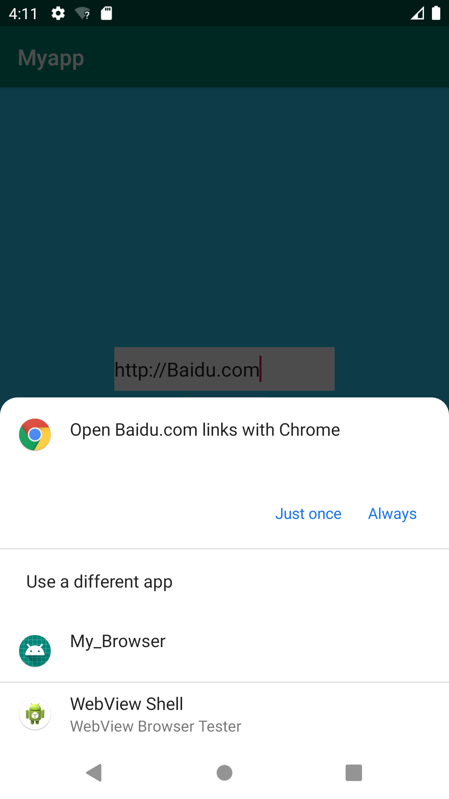

# Intent用法

---

演示使用隐式Intent调用第三方应用。具体而言，第一个应用输入URL地址，然后调用我们自己创建的Browser进行访问。包括2个应用：ImplicitIntent和My_Browser。

### ImplicitIntent

目的：输入一个网址，点击按钮开始浏览网页。

**布局文件：**

```
<?xml version="1.0" encoding="utf-8"?>
<androidx.constraintlayout.widget.ConstraintLayout xmlns:android="http://schemas.android.com/apk/res/android"
    xmlns:app="http://schemas.android.com/apk/res-auto"
    xmlns:tools="http://schemas.android.com/tools"
    android:layout_width="match_parent"
    android:layout_height="match_parent"
    tools:context=".MainActivity"
    android:background="#2BC9F1">

    <Button
        android:id="@+id/btn_browse"
        android:layout_width="wrap_content"
        android:layout_height="wrap_content"

        android:useLevel="true"
        android:text="@string/btn_browse"

        app:layout_constraintBottom_toBottomOf="parent"
        app:layout_constraintLeft_toLeftOf="parent"
        app:layout_constraintRight_toRightOf="parent"
        app:layout_constraintTop_toTopOf="parent" />

    <EditText
        android:id="@+id/editText"
        android:layout_width="202dp"
        android:layout_height="40dp"

        android:background="@color/colorWite"
        android:hint="@string/hint_edit"
        android:textSize="18sp"
        app:layout_constraintBottom_toTopOf="@+id/btn_browse"
        app:layout_constraintLeft_toLeftOf="parent"
        app:layout_constraintRight_toRightOf="parent" />

</androidx.constraintlayout.widget.ConstraintLayout>

```

样式：


**主要功能Activity文件：**

```
package com.example.implicitintent;

import androidx.appcompat.app.AppCompatActivity;


import android.content.Intent;

import android.net.Uri;

import android.os.Bundle;

import android.view.View;

import android.widget.Button;

import android.widget.EditText;


public class MainActivity extends AppCompatActivity {

    EditText editText;

    Button btn_browse;


    @Override

    protected void onCreate(Bundle savedInstanceState) {

        super.onCreate(savedInstanceState);

        setContentView(R.layout.activity_main);

        editText = (EditText) findViewById(R.id.editText);

        btn_browse = (Button) findViewById(R.id.btn_browse);

        btn_browse.setOnClickListener(new View.OnClickListener() {

            @Override

            public void onClick(View view) {

                String url = editText.getText().toString();

                Intent intent = new Intent();

                intent.setAction(Intent.ACTION_VIEW);

                intent.setData(Uri.parse(url));

                startActivity(intent);

            }

        });

    }

}
```

### My_Browser

目的：利用WebView来加载网页。

**AndroidManifest.xml文件：**

这里表明该Activity将能够响应action为VIEW，并且协议是http的Intent。

```
<?xml version="1.0" encoding="utf-8"?>
<manifest xmlns:android="http://schemas.android.com/apk/res/android"
    package="com.lcr.my_browser">

    <uses-permission android:name="android.permission.INTERNET" />

    <application
        android:allowBackup="true"
        android:icon="@mipmap/ic_launcher"
        android:label="@string/app_name"
        android:roundIcon="@mipmap/ic_launcher_round"
        android:supportsRtl="true"
        android:theme="@style/AppTheme"
        android:usesCleartextTraffic="true"
        android:networkSecurityConfig="@xml/network_security_config">

        <activity android:name=".BroserActivity">
            <intent-filter>
                <action android:name="android.intent.action.VIEW" />
                <category android:name="android.intent.category.DEFAULT" />
                <category android:name="android.intent.category.BROWSABLE" />
                <data android:scheme="http" />
            </intent-filter>
        </activity>
    </application>

</manifest>
```

**主要功能Activity文件：**

```
import android.content.Intent;
import android.net.Uri;
import android.os.Bundle;
import android.webkit.WebView;
import android.webkit.WebViewClient;

import androidx.appcompat.app.AppCompatActivity;

import java.net.URL;

public class BroserActivity extends AppCompatActivity {

    @Override
    protected void onCreate(Bundle savedInstanceState) {
        super.onCreate(savedInstanceState);
        setContentView(R.layout.activity_broser);
        Intent intent = getIntent();
        Uri data = intent.getData();
        URL url = null;

        try {
            url = new URL(data.getScheme(), data.getHost(),
                    data.getPath());
        } catch (Exception e) {
            e.printStackTrace();
        }
        startBrowser(url);

    }

    private void startBrowser(URL url) {
        WebView webView = (WebView) findViewById(R.id.webView);
        //加载web资源
        webView.loadUrl(url.toString());
        //重写webview的setWebViewClient方法，使网页用WebView打开，而不是默认第三方浏览器
        webView.setWebViewClient(new WebViewClient(){
            @Override
            public boolean shouldOverrideUrlLoading(WebView view, String url) {
                view.loadUrl(url);
                //返回值是true的时候控制去WebView打开，为false调用系统浏览器或第三方浏览器
                return true;
            }
        });
    }

}

```

**过程：**

1.输入网址，点击访问后，弹出选择：



2.选择自己的浏览器

