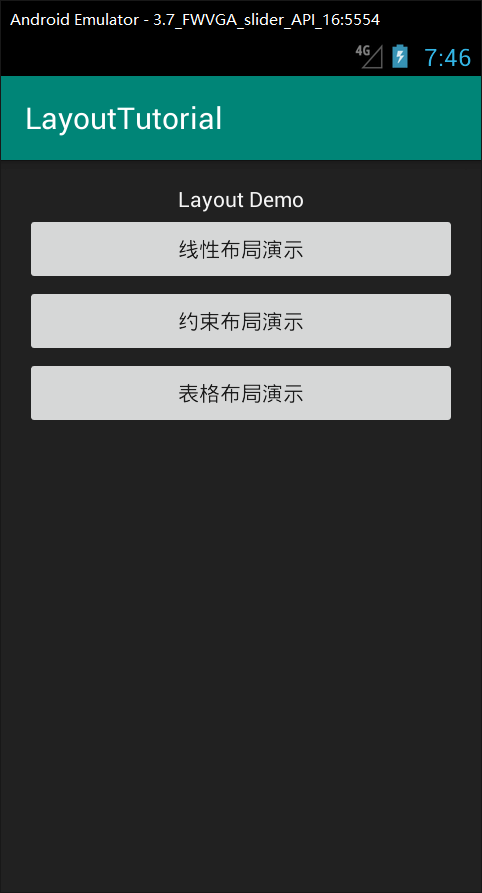
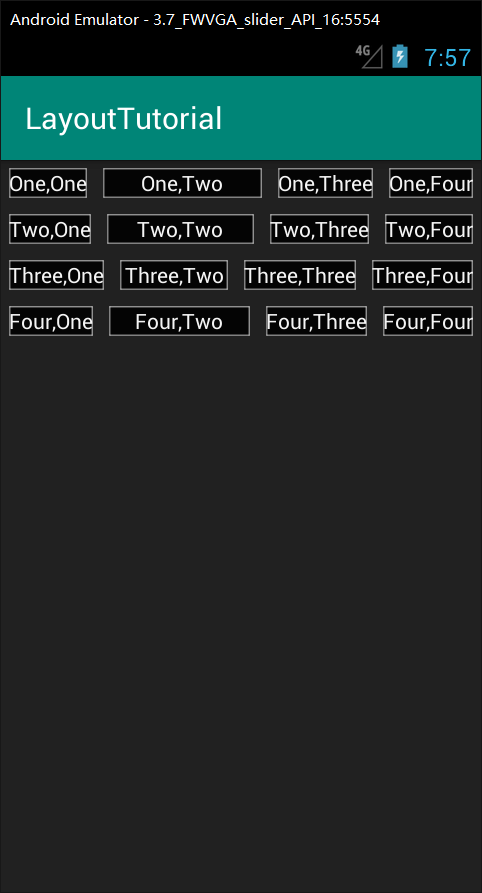
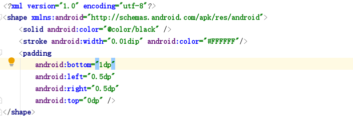
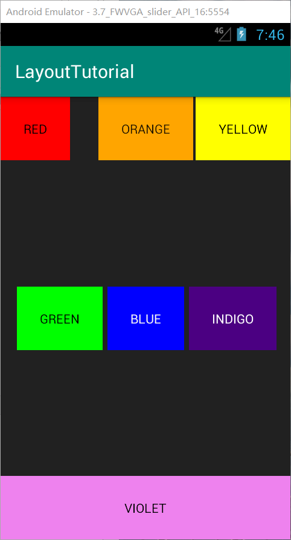
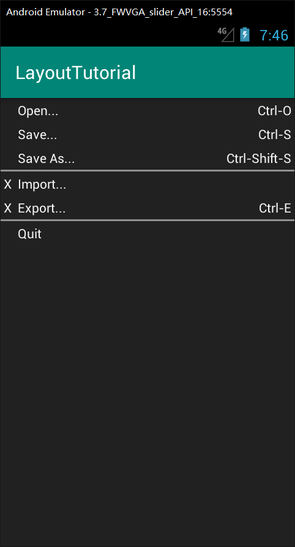

# LayoutTutorial

### **一、初始化界面**

### **二、线性布局页面**

**线性布局设置边框：**

首先在res目录下新建一个xml文件，类型选择drawable，将自动生一个一个drawable文件(我用的sdk是android 4.1)，并生成一个xml文件，在其中写入以下代码：

在要设置边框的控件xml命令里加入：`android：[background=“@drawable/boder]`

### **三、Constraint布局页面**

宽度随内容改变：`android:layout_width="wrap_content"`

控制位置：`app:layout_constraintBottom_toBottomOf=""`
       		    `app:layout_constraintLeft_toLeftOf=""`
       		    `app:layout_constraintRight_toRightOf=""`
      			 `app:layout_constraintTop_toTopOf="" `

### **四、表格布局页面**

**分割线的使用：**

`<View`

`android:layout_height="2dp"`

`android:background="#FF909090"/>`

---

