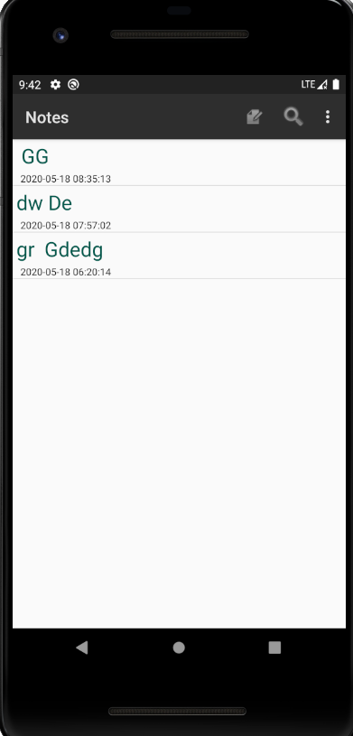
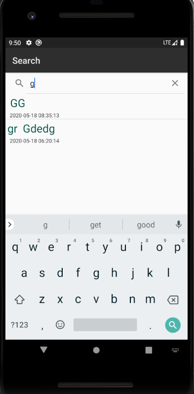
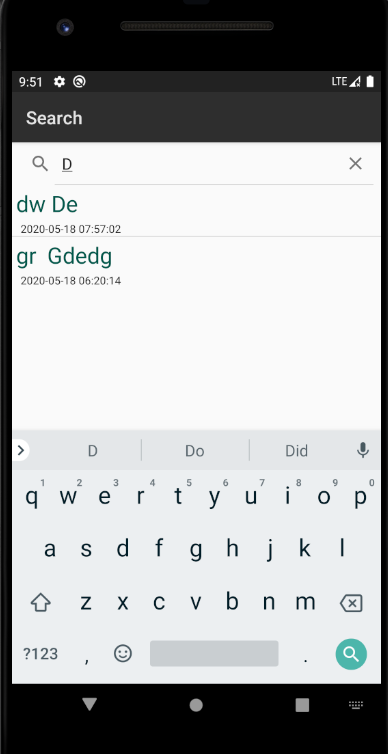

# NotePad
### **笔记时间戳：**

**1.noteslist_item.xml中的样式，增加要显示时间戳的TextView**

```
<?xml version="1.0" encoding="utf-8"?>
<LinearLayout xmlns:android="http://schemas.android.com/apk/res/android"
    android:layout_width="match_parent"
    android:layout_height="match_parent"
    android:orientation="vertical">

    <TextView xmlns:android="http://schemas.android.com/apk/res/android"
        android:id="@+id/text1"
        android:layout_width="match_parent"
        android:layout_height="40dp"
        android:textAppearance="?android:attr/textAppearanceLarge"
        android:gravity="center_vertical"
        android:paddingLeft="5dip"
        android:textColor="@color/colorPrimaryDark"
        android:singleLine="true"
        android:textSize="25dp"
        />
    <!--添加 显示时间 的TextView-->
    <TextView
        android:id="@+id/text2"
        android:layout_width="match_parent"
        android:layout_height="match_parent"
        android:textAppearance="?android:attr/textAppearanceLarge"
        android:textSize="12dp"
        android:gravity="center_vertical"
        android:paddingLeft="10dip"
        android:singleLine="true"
        android:layout_weight="1"
        android:layout_margin="0dp"
        />

</LinearLayout>
```

------

**2.在NodeEditor.java中,找到updateNode()这个函数，选取修改时间这一字段，并将其格式化存入数据库**

```
Date nowTime = new Date(System.currentTimeMillis());
        SimpleDateFormat sdFormatter = new SimpleDateFormat("yyyy-MM-dd HH:mm:ss");
        String retStrFormatNowDate = sdFormatter.format(nowTime);

        values.put(NotePad.Notes.COLUMN_NAME_MODIFICATION_DATE, retStrFormatNowDate);
```

------

**3.在NoteList.java的PROJECTION数组中增加该字段的描述，并在SimpleCursorAdapter中的参数viewsIDs和dataColumns增加子段描述，以达到将其读出和显示的目的**

```
//The columns needed by the cursor adapter
private static final String[] PROJECTION = new String[] {
            NotePad.Notes._ID, // 0
            NotePad.Notes.COLUMN_NAME_TITLE, // 1
            NotePad.Notes.COLUMN_NAME_MODIFICATION_DATE,
    };
// The names of the cursor columns to display in the view, initialized to the title column
private String[] dataColumns = { NotePad.Notes.COLUMN_NAME_TITLE ,NotePad.Notes.COLUMN_NAME_MODIFICATION_DATE} ;
// The view IDs that will display the cursor columns, initialized to the TextView in
private int[] viewIDs = { R.id.text1,R.id.text2 };
```

注：viewIDs要与布局 noteslist_item.xml中android:id一致，不然没有结果显示。

------

### 效果：



------

### **笔记查询（标题查询）：**

**1.在list_options_menu.xml文件，添加一个搜索的item**

```
 <item
        android:id="@+id/menu_search"
        android:title="Search"
        android:icon="@android:drawable/ic_search_category_default"
        android:showAsAction="always"
       />
```

------

**2.在NotesList中找到onOptionsItemSelected方法，在switch中添加搜索的case语句**

```
 //添加搜索
            case R.id.menu_search:
                Intent intent = new Intent();
                intent.setClass(NotesList.this,NoteSearch.class);
                NotesList.this.startActivity(intent);
                return true;
```

------

**3.新建note_search_list.xml布局文件**

```
<?xml version="1.0" encoding="utf-8"?>
<LinearLayout xmlns:android="http://schemas.android.com/apk/res/android"
    android:orientation="vertical" android:layout_width="match_parent"
    android:layout_height="match_parent">

    <SearchView
        android:id="@+id/search_view"
        android:layout_width="match_parent"
        android:layout_height="wrap_content"
        android:iconifiedByDefault="false"
        android:queryHint="输入搜索内容..."
        android:layout_alignParentTop="true">
    </SearchView>

    <ListView
        android:id="@android:id/list"
        android:layout_width="match_parent"
        android:layout_height="wrap_content">
    </ListView>

</LinearLayout>
```

------

**4.新建NoteSearch.java用来显示跳转的搜索界面的内容和功能**

```
package com.example.android.notepad;

import android.app.ListActivity;
import android.content.ContentUris;
import android.content.Intent;
import android.database.Cursor;
import android.net.Uri;
import android.os.Bundle;
import android.view.View;
import android.widget.ListView;
import android.widget.SearchView;
import android.widget.SimpleCursorAdapter;

public class NoteSearch extends ListActivity  implements SearchView.OnQueryTextListener {

    private static final String[] PROJECTION = new String[]{
            NotePad.Notes._ID, // 0
            NotePad.Notes.COLUMN_NAME_TITLE, // 1
            NotePad.Notes.COLUMN_NAME_MODIFICATION_DATE, // 时间
    };

    @Override
    protected void onCreate(Bundle savedInstanceState) {
        super.onCreate(savedInstanceState);
        setContentView(R.layout.note_search_list);
        Intent intent = getIntent();
        if (intent.getData() == null) {
            intent.setData(NotePad.Notes.CONTENT_URI);
        }
        SearchView searchview = (SearchView) findViewById(R.id.search_view);
        searchview.setOnQueryTextListener(NoteSearch.this);  //为查询文本框注册监听器
    }

    @Override
    public boolean onQueryTextSubmit(String query) {
        return false;
    }

    @Override
    public boolean onQueryTextChange(String newText) {

        String selection = NotePad.Notes.COLUMN_NAME_TITLE + " Like ? ";

        String[] selectionArgs = {"%" + newText + "%"};

        Cursor cursor = managedQuery(
                getIntent().getData(),            // Use the default content URI for the provider.
                PROJECTION,                       // Return the note ID and title for each note. and modifcation date
                selection,                        // 条件左边
                selectionArgs,                    // 条件右边
                NotePad.Notes.DEFAULT_SORT_ORDER  // Use the default sort order.
        );

        String[] dataColumns = {NotePad.Notes.COLUMN_NAME_TITLE, NotePad.Notes.COLUMN_NAME_MODIFICATION_DATE};
        int[] viewIDs = {R.id.text1, R.id.text2};

        // Creates the backing adapter for the ListView.
        SimpleCursorAdapter adapter
                = new SimpleCursorAdapter(
                this,                             // The Context for the ListView
                R.layout.noteslist_item,          // Points to the XML for a list item
                cursor,                           // The cursor to get items from
                dataColumns,
                viewIDs
        );

        // Sets the ListView's adapter to be the cursor adapter that was just created.
        setListAdapter(adapter);
        return true;
    }

    @Override
    protected void onListItemClick(ListView l, View v, int position, long id) {

        // Constructs a new URI from the incoming URI and the row ID
        Uri uri = ContentUris.withAppendedId(getIntent().getData(), id);

        // Gets the action from the incoming Intent
        String action = getIntent().getAction();

        // Handles requests for note data
        if (Intent.ACTION_PICK.equals(action) || Intent.ACTION_GET_CONTENT.equals(action)) {

            // Sets the result to return to the component that called this Activity. The
            // result contains the new URI
            setResult(RESULT_OK, new Intent().setData(uri));
        } else {

            // Sends out an Intent to start an Activity that can handle ACTION_EDIT. The
            // Intent's data is the note ID URI. The effect is to call NoteEdit.
            startActivity(new Intent(Intent.ACTION_EDIT, uri));
        }
    }
}

```

------

**5.在AndroidManifest.xml注册NoteSearch**

```
<!--添加搜索activity-->
        <activity
            android:name="NoteSearch"
            android:label="Search">
        </activity>
```

------

### 效果：




