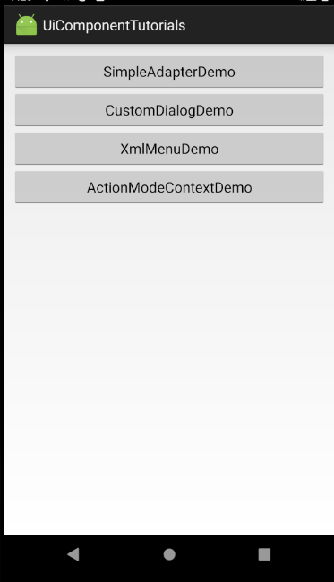
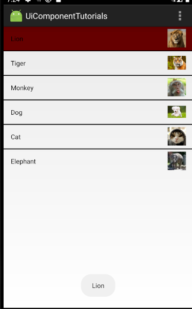
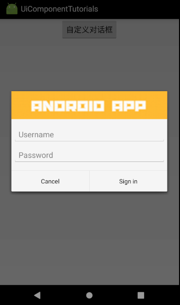
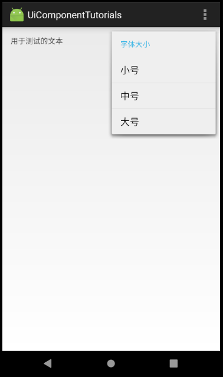
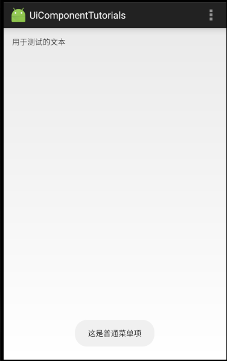
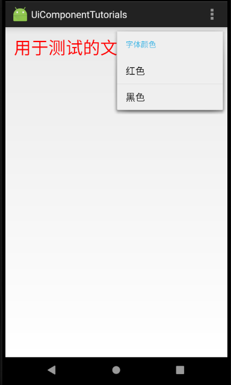
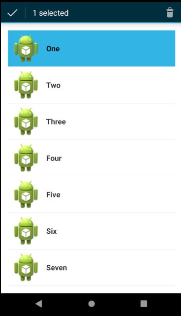

# UI组件

首先是导航页面，添加几个按钮跳转到不同的界面演示不同UI组件的用法： 



SimpleAdapterDemo演示SimpleAdapter的用法；CustomDialogDemo演示自定义对话框的实现；XmlMenuDemo演示如何使用xml文件定义菜单；AcitonModeContextDemo演示如何使用ACtionMode形式的上下文操作模式菜单；

## ListView的用法


SimpleAdapter用来装配ListView的用法。ListView每个Item的布局采用相对布局，包含一个ImageView和一个TextView，并且指定ImageView对齐父类布局的右侧。

**定义：ListView条目单击显示颜色可以指定其listSelector属性。**  

    <ListView
        android:id="@+id/simpleListView"
        android:layout_width="match_parent"
        android:layout_height="wrap_content"
        android:divider="#000"
        android:dividerHeight="2dp"
        android:listSelector="#600"/>

**定义一个TextView和ImageView。**  

```
    <ImageView
        android:id="@+id/image"
        android:layout_width="50dp"
        android:layout_height="50dp"
        android:padding="5dp"
        android:layout_marginRight="10dp" />

    <TextView
        android:id="@+id/text"
        android:layout_width="wrap_content"
        android:layout_height="wrap_content"
        android:padding="5dp"
        android:textColor="#000" />
```

**在Activity内实现功能。** 

```
public class SimpleAdapterTutorial extends Activity {

    ListView simpleListView;
    String[] animalName={"Lion","Tiger","Monkey","Dog","Cat","Elephant"};
    int[] animalImages={R.drawable.lion,R.drawable.tiger,R.drawable.monkey,R.drawable.dog,R.drawable.cat,R.drawable.elephant};
    @Override
    protected void onCreate(Bundle savedInstanceState) {
        super.onCreate(savedInstanceState);
        setContentView(R.layout.activity_simple_adapter_tutorial);
        simpleListView=(ListView)findViewById(R.id.simpleListView);
		//定义hashmap存放资源
        ArrayList<HashMap<String,String>> arrayList=new ArrayList<>();
        for (int i=0;i<animalName.length;i++)
        {
            HashMap<String,String> hashMap=new HashMap<>();
            hashMap.put("name",animalName[i]);
            hashMap.put("image",animalImages[i]+"");
            arrayList.add(hashMap);
        }
        String[] from={"name","image"};
        int[] to={R.id.textView,R.id.imageView};
        //为ListView绑定adapter
        SimpleAdapter simpleAdapter=new SimpleAdapter(this,arrayList,R.layout.list_view_items,from,to);/
        simpleListView.setAdapter(simpleAdapter);//sets the adapter for listView

        //为ListView设置监听事件
        simpleListView.setOnItemClickListener(new AdapterView.OnItemClickListener() {
            @Override
            public void onItemClick(AdapterView<?> adapterView, View view, int i, long l) {
                Toast.makeText(getApplicationContext(),animalName[i],Toast.LENGTH_LONG).show();
            }
        });
    }

    @Override
    public boolean onCreateOptionsMenu(Menu menu) {
        getMenuInflater().inflate(R.menu.menu_main, menu);
        return true;
    }

    @Override
    public boolean onOptionsItemSelected(MenuItem item) {
        int id = item.getItemId();
        if (id == R.id.action_settings) {
            return true;
        }

        return super.onOptionsItemSelected(item);
    }
}
```

 

## 自定义对话框的实现



自定义对话框使用getLayoutInflater()获取LayoutInflater实例，并利用LayoutInflater的inflate()方法从自定义布局文件中加载对话框的布局，从而实现自定义对话框。对话框的布局如下：

    <LinearLayout xmlns:android="http://schemas.android.com/apk/res/android"
    	android:orientation="vertical"
    	android:layout_width="wrap_content"
    	android:layout_height="wrap_content">
        <ImageView
            android:src="@drawable/header_logo"
            android:layout_width="match_parent"
            android:layout_height="64dp"
            android:scaleType="center"
            android:background="#FFFFBB33"
            android:contentDescription="@string/app_name" />
        <EditText
            android:id="@+id/username"
            android:inputType="textEmailAddress"
            android:layout_width="match_parent"
            android:layout_height="wrap_content"
            android:layout_marginTop="16dp"
            android:layout_marginLeft="4dp"
            android:layout_marginRight="4dp"
            android:layout_marginBottom="4dp"
            android:hint="@string/username" />
        <EditText
            android:id="@+id/password"
            android:inputType="textPassword"
            android:layout_width="match_parent"
            android:layout_height="wrap_content"
            android:layout_marginTop="4dp"
            android:layout_marginLeft="4dp"
            android:layout_marginRight="4dp"
            android:layout_marginBottom="16dp"
            android:fontFamily="sans-serif"
            android:hint="@string/password"/>
    </LinearLayout>

**在Activity内实现功能。**

```
public class CustomDialogTutorial extends Activity {


    @Override
    protected void onCreate(Bundle savedInstanceState) {
        super.onCreate(savedInstanceState);
        setContentView(R.layout.activity_custom_dialog_tutorial);
        Button btn_custom_dialog = (Button)findViewById(R.id.custom_dialog_btn);
        btn_custom_dialog.setOnClickListener(new View.OnClickListener() {
            @Override
            public void onClick(View view) {
                createDialog();
            }
        });
    }

    public void createDialog() {
        AlertDialog.Builder builder = new AlertDialog.Builder(this);
        LayoutInflater inflater = getLayoutInflater();
        builder.setView(inflater.inflate(R.layout.custom_dialog, null))
                .setPositiveButton(R.string.signin, new DialogInterface.OnClickListener() {
                    @Override
                    public void onClick(DialogInterface dialog, int id) {
                    }
                })
                .setNegativeButton(R.string.cancel, new DialogInterface.OnClickListener() {
                    public void onClick(DialogInterface dialog, int id) {
                    }
                });
        builder.create();
        builder.show();
    }

}
```


## 使用XML定义菜单

**字体大小：**



**普通菜单项：**



**字体颜色：**



在res文件夹下新建menu文件夹，并新建一个xml文件来定义菜单，具体的XML文件内容:

    <menu xmlns:android="http://schemas.android.com/apk/res/android">
        <item android:title="@string/menu_Font">
            <menu>
                <item
                    android:id="@+id/menu_font_small"
                    android:title="@string/menu_font_small"/>
                <item
                    android:id="@+id/menu_font_middle"
                    android:title="@string/menu_font_middle"/>
                <item
                    android:id="@+id/menu_font_big"
                    android:title="@string/menu_font_big"/>
            </menu>
    
        </item>
        <item
            android:id="@+id/menu_normal"
            android:title="@string/menu_Normal">
        </item>
        <item android:title="@string/menu_Color">
            <menu>
                <item
                    android:id="@+id/menu_color_red"
                    android:title="@string/menu_color_red" />
                <item
                    android:id="@+id/menu_color_black"
                    android:title="@string/menu_color_black"/>
            </menu>
        </item>
    </menu>

## 创建ActionMode模式的上下文菜单


应用如何调用上下文操作模式以及如何定义每个操作的行为. 设计基本上分为两种：


- 针对单个任意视图的上下文操作。
- 针对 ListView 或 GridView 中项目组的批处理上下文操作（允许用户选择多个项目并针对所有项目执行操作）。

这里演示在 ListView 或 GridView 中启用批处理上下文操作

如果在 ListView 或 GridView 中有一组项目（或 AbsListView 的其他扩展），且需要允许用户执行批处理操作，则应：

- 实现 AbsListView.MultiChoiceModeListener 接口，并使用 setMultiChoiceModeListener() 为视图组设置该接口。在侦听器的回调方法中，您既可以为上下文操作栏指定操作，也可以响应操作项目的点击事件，还可以处理从 ActionMode.Callback 接口继承的其他回调。

- 使用 CHOICE_MODE_MULTIPLE_MODAL 参数调用 setChoiceMode()。

    **布局：**
    
            android:layout_width="match_parent"
            android:layout_height="match_parent"
            android:paddingBottom="@dimen/activity_vertical_margin"
            android:paddingLeft="@dimen/activity_horizontal_margin"
            android:paddingRight="@dimen/activity_horizontal_margin"
            android:paddingTop="@dimen/activity_vertical_margin"
            tools:context=".ContextualActionBarTutorial"
            android:background="@android:color/background_light" >
        
            <ListView
                android:id="@android:id/list"
                android:layout_width="match_parent"
                android:layout_height="wrap_content"
                android:layout_centerVertical="true"
                android:choiceMode="multipleChoice">
            </ListView>
    
    **重写adapter：**
    
    ```
    
        private class SelectionAdapter extends ArrayAdapter<String> {
    
            private HashMap<Integer, Boolean> mSelection = new HashMap<Integer, Boolean>();
    
            public SelectionAdapter(Context context, int resource,
                                    int textViewResourceId, String[] objects) {
                super(context, resource, textViewResourceId, objects);
            }
    
            public void setNewSelection(int position, boolean value) {
                mSelection.put(position, value);
                notifyDataSetChanged();
            }
    
            public boolean isPositionChecked(int position) {
                Boolean result = mSelection.get(position);
                return result == null ? false : result;
            }
    
            public Set<Integer> getCurrentCheckedPosition() {
                return mSelection.keySet();
            }
    
            public void removeSelection(int position) {
                mSelection.remove(position);
                notifyDataSetChanged();
            }
    
            public void clearSelection() {
                mSelection = new HashMap<Integer, Boolean>();
                notifyDataSetChanged();
            }
    
            @Override
            public View getView(int position, View convertView, ViewGroup parent) {
                View v = super.getView(position, convertView, parent);//let the adapter handle setting up the row views
                v.setBackgroundColor(getResources().getColor(android.R.color.background_light)); //default color
    
                if (mSelection.get(position) != null) {
                    v.setBackgroundColor(getResources().getColor(android.R.color.holo_blue_light));// this is a selected position so make it red
                }
                return v;
            }
        }
    ```
    
    

